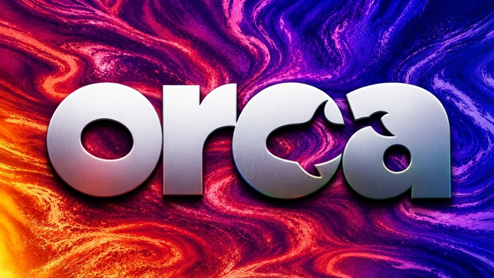
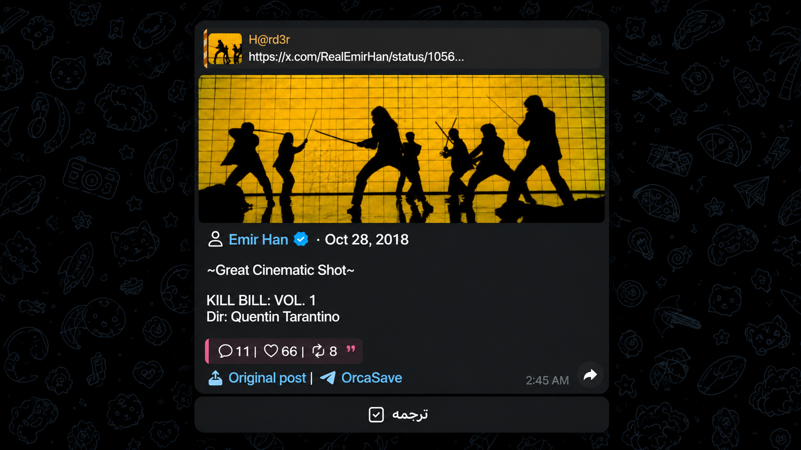
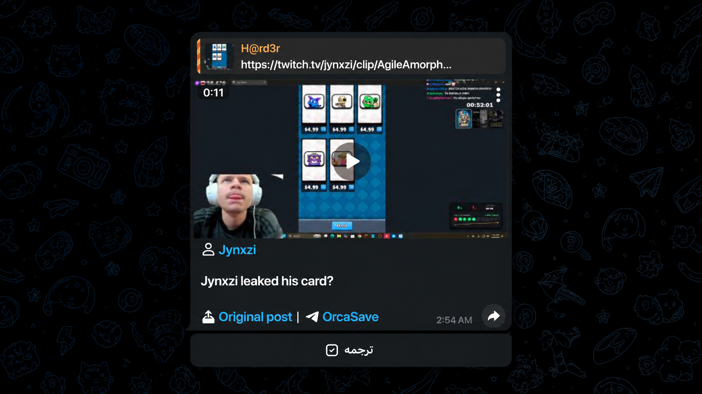

[**English Version**](./README.md) | [**نسخه فارسی**](./README_FA.md)

---
# ربات تلگرام اورکا سیو | Orca Save

> لینک ویدیو یا عکس رو بفرست و همون‌جا تو تلگرام دانلودشده تحویل بگیر.

---

## امتحانش کن

ربات روی تلگرامه — از اینجا بازش کن:

---

## درباره پروژه

**اورکا سیو (Orca Save)** یه ربات تلگرامیه برای دانلود ویدیو و عکس از شبکه‌های اجتماعی. فقط کافیه لینک رو بفرستی — ربات فایل رو می‌گیره و با کپشنش برمی‌گردونه تو چت.

کل ربات دوزبانه‌ست (فارسی/انگلیسی) — هر وقت خواستی با `/lang` عوضش کن.

> یه پست ایکس و یه کلیپ توییچ که با ربات دانلود شدن:

---

## پلتفرم‌های پشتیبانی‌شده

* **𝕏 (توییتر / ایکس)**
* **اینستاگرام**
* **تیک‌تاک**
* **یوتیوب**
* **فیسبوک**
* **تردز**
* **پینترست**
* **توییچ**

---

## امکانات

* **دانلود با یه لمس:** هر لینک پشتیبانی‌شده رو بفرست، فایل رو تو چت تحویل بگیر.
* **انتخاب کیفیت:** رو لینک‌های یوتیوب بین بهترین کیفیت، 720p یا صوتی MP3 انتخاب کن.
* **ترجمه کپشن:** پست‌های متنی (توییت، تردز، بیو، کلیپ توییچ) دکمه ترجمه دارن.
* **دو زبون:** با یه لمس بین فارسی و انگلیسی جابه‌جا شو (راست‌به‌چپ کامل).
* **راهنما:** آموزش استفاده از ربات با دستور `/help` داخل خود ربات.

---

## دستورات ربات

| دستور | توضیحات |
| :--- | :--- |
| `/start` | شروع ربات |
| `/help` | آموزش استفاده از ربات |
| `/lang` | عوض کردن زبون (فارسی / انگلیسی) |

برای دانلود هیچ دستوری لازم نیست — فقط لینک ویدیو یا عکس رو بفرست.

---

## سلب مسئولیت

تمام حقوق محفوظ است — [LICENSE](./LICENSE) را ببینید.
